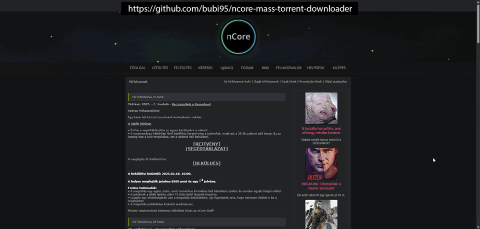

# nCore Mass Torrent Downloader

⚠️ **Csak oktatási és személyes célokra!**

Ez egy Tampermonkey / Violentmonkey userscript, ami automatizálja az nCore keresési találatokból a torrent fájlok letöltését.

---

## ✨ Funkciók

- Automata letöltés akár **100 találatig**
- **Módválasztó**:
  - 🐢 Normál (7–18 mp emberi késleltetés)
  - ⚡ Gyors (0.3–0.6 mp várakozás)
  - 💀 Embertelen (szinte azonnal, várakozás nélkül)
- Véletlen sorrend opció
- Log + Auto-scroll kapcsoló
- Részletes statisztika
- Hangjelzés a futás végén (hangerő csúszka, némítás opció)
- Teljesen magyar felület (HUD)

---

## 📥 Telepítés

1. Telepítsd a [Tampermonkey](https://www.tampermonkey.net/) vagy [Violentmonkey](https://violentmonkey.github.io/) bővítményt.
2. Kattints a [`ncore-mass-torrent-downloader.user.js`](./ncore-mass-torrent-downloader.user.js) fájlra → **Raw** → Tampermonkey telepítés.
3. Nyisd meg az `ncore.pro` keresési találat oldalát.
4. A jobb felső sarokban megjelenik a kezelőpanel.

---

## 🌍 Böngésző kompatibilitás

A script bármely modern böngészőben működik, ha van hozzá Tampermonkey vagy Violentmonkey telepítve:

- ✅ Google Chrome / Edge / Brave / Opera (Chromium alapú)
- ✅ Mozilla Firefox
- ✅ Safari (Tampermonkey fizetős, Violentmonkey ingyen)
- ✅ Android: Kiwi Browser (Tampermonkey támogatással)

---

## 🎬 Működés közben

Egy rövid demó arról, hogyan néz ki használat közben:

---

## 🧃 Támogatás

Ez a projekt hobbiból készült, saját fejlődésem és szórakozásom érdekében.  
Ha tetszett, vagy hasznosnak találtad, és **meghívnál egy kávéra vagy egy pizzára**, itt tudod megtenni:  

Köszönöm előre is, minden támogatás nagy öröm! ❤️

---

## 💡 Jövőbeli frissítések / Roadmap

A tervezett fejlesztések, amiket szeretnék hozzáadni a jövőben:

- 🎯 Automata szűrés találatoknál (pl. kategória, seed szám, release group alapján)
- 🚫 Blacklist / Whitelist rendszer (kulcsszavak tiltása vagy engedélyezése)
- 📂 Letöltési napló exportálása (TXT/CSV fájlba)
- 🔔 Böngésző értesítés a futás végén
- ⌨️ Billentyűparancsok (pl. Alt+L = indítás, Alt+S = stop)
- ⚙️ Beállítások import/export (mentés és megosztás JSON formátumban)
- ♻️ Seed-kötelezett auto-visszaállítás  
  Ha sok (pl. 200+) torrentet futtatsz és újratelepíted a géped, jelenleg egyesével kell újra letölteni a kötelező seed torrenteket.  
  A terv, hogy a script a seed-kötelezett listából automatikusan **végigmegy az összes torrenten és letölti őket**, így nem kell manuálisan kattintgatni.

Ha van további ötleted, nyiss egy [issue-t](../../issues), vagy jelezd!

---

## 📜 Licenc

MIT License.  
A fejlesztő semmilyen felelősséget nem vállal a script használatából eredő következményekért.
